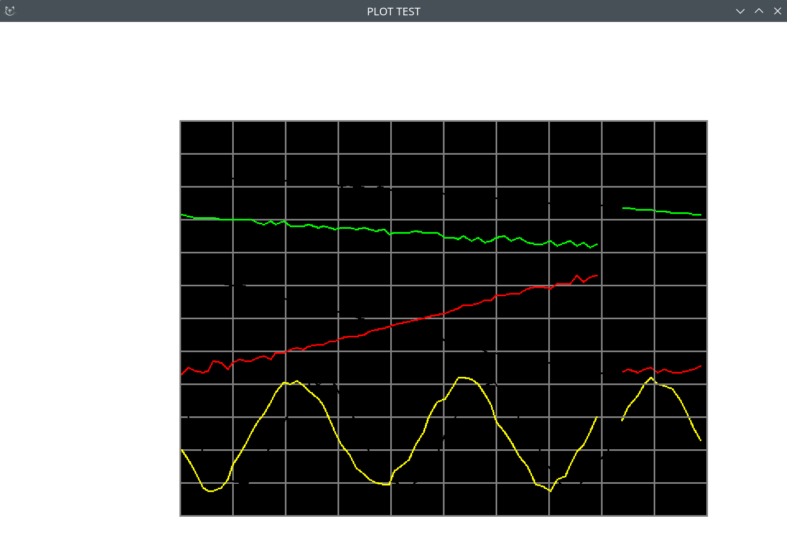

# Sensor Display Test Setup with Qt Simulation

This project provides a **test environment for display and sensor modules** used in embedded systems.  
It includes both the **embedded C firmware** for the STM32 microcontroller and a **Qt-based desktop simulator** that emulates sensor data and display output.  
The simulator allows you to test plotting, drawing, and data visualization logic without actual hardware.

---

## 🧩 Hardware and Software Setup

### Embedded System
- **MCU:** STM32F103  
- **Sensors:** HX711-based load cell amplifiers (3 channels)  
- **Display:** LCD display (BSP-compatible drawing API)  
- **Features:**  
  - Real-time sensor data acquisition  
  - On-screen graph plotting  
  - Grid and buffer-based plot management  

### Qt Desktop Simulator
- Written in **C++/Qt** for PC testing  
- Reimplements HAL functions (`HAL_GPIO_*`, `BSP_LCD_*`, etc.)  
- Draws simulated LCD output using Qt’s `QPainter`  
- Generates pseudo-random wave signals for sensor input  
- Useful for debugging and validating the display and plotting logic on a desktop  

---

### Example Picture

  

